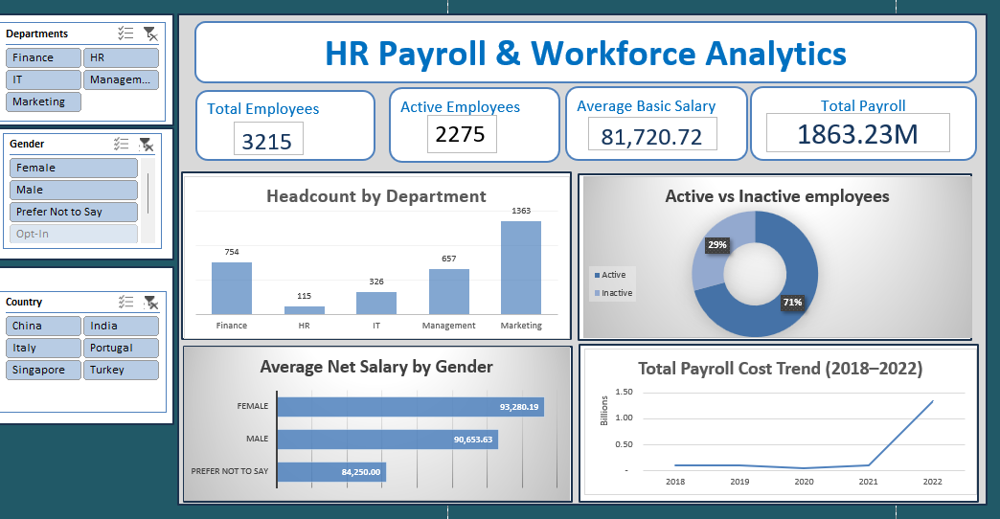

# HR Payroll & Workforce Analytics

End-to-end HR payroll analysis using Excel — covering data
cleaning, advanced formulas, pivot tables and interactive dashboard

## Dashboard Preview

## Project Overview
This project analyses payroll and workforce data for 3,215 employees
across 5 departments and 9 countries. The goal was to uncover payroll
cost trends, salary distributions, gender pay patterns and workforce
composition through Excel-based analysis and an interactive dashboard.

## Data Source
- **Dataset:** HR Payroll Dataset
- **Source:** https://www.kaggle.com/datasets/vaishnavisalgarkar/payroll-data
- **Records:** 3,216 rows | 47 columns
- **Departments:** HR, IT, Finance, Marketing, Management
- **Countries:** India, Ireland, Isle of Man, Jersey, Lebanon,
  Malaysia, Portugal, Romania, Singapore

## Tools
- **Excel** — Data cleaning, advanced formulas, pivot tables
  and interactive dashboard

## Data Cleaning
- Inspected all 47 columns using COUNTBLANK formula to identify
  and quantify null values across the dataset
- Fixed column name typos including Business Unit Name, Effective
  Start Date, Employee Category, Ethnicity and Marital Status
- Converted date serial numbers to readable date format (DD/MM/YYYY)
  across all date columns
- Filled 28 missing First Name values with "Unknown"
- Filled 111 missing Last Name values with "Unknown"
- Filled 225 missing Grade values with "Ungraded"
- Filled 283 missing Total Deductions values with 0
- Filled missing Arrear Statutory Bonus values with 0 to represent
  employees with no arrear bonus in that period
- Dropped Continuous Service Date (2,929 nulls), ReHire Date
  (3,165 nulls) and Resignation Date (2,919 nulls) due to
  insufficient data coverage
- Added helper columns including Salary Band, Net Pay Ratio (%),
  Salary Variance, Full Name and Payroll Year to support analysis

## Analysis
- **Headcount by Department** — employee distribution across
  5 departments to understand organisational structure
- **Active vs Inactive Employees** — workforce status split
  showing active and inactive employee proportions
- **Gender Pay Analysis** — average net salary compared across
  Male, Female and Prefer Not to Say categories
- **Payroll Cost Trend** — total gross salary tracked from
  2018 to 2022 to identify payroll growth patterns
- **Salary Band Distribution** — employees categorised into
  Low, Mid and High salary bands based on basic salary

## Key Formulas Used
- `COUNTIF` — headcount by department and status
- `AVERAGEIF` — average salary by department and gender
- `SUMIF` — total payroll by department
- `MAXIFS` / `MINIFS` — salary range by department
- `IFERROR` — error handling on division calculations
- `IF` / `TEXT` — helper column creation
- `COUNTBLANK` — null value identification
- `INDEX` — column header inspection
- `COUNTA` — total employee count

## Results
- Total workforce of 3,215 employees generating 1.86B in total payroll
- Marketing is the largest department at 1,363 employees
- Female employees earn slightly more on average at 93,280
  vs Male at 90,653 — a 2,627 pay gap
- Total payroll grew significantly from 2018 to 2022 with a
  sharp spike in 2022 reaching 1.33B in that year alone
- IT has the highest average basic salary at 83,920
- HR is the smallest department at 115 employees

## Recommendations
- Investigate the sharp 2022 payroll spike — likely driven by
  new hires or salary adjustments in Marketing given its
  dominant headcount
- Address grade distribution — employees in grades J, K and L
  earn significantly less and may benefit from structured
  progression pathways
- Monitor gender pay gap across departments to ensure equitable
  compensation as the workforce grows
- HR department at 115 employees supporting 3,215 staff may be
  understaffed — consider reviewing HR to employee ratio
